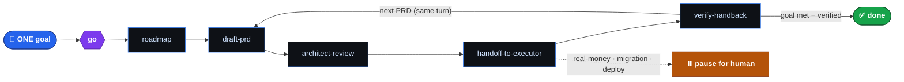
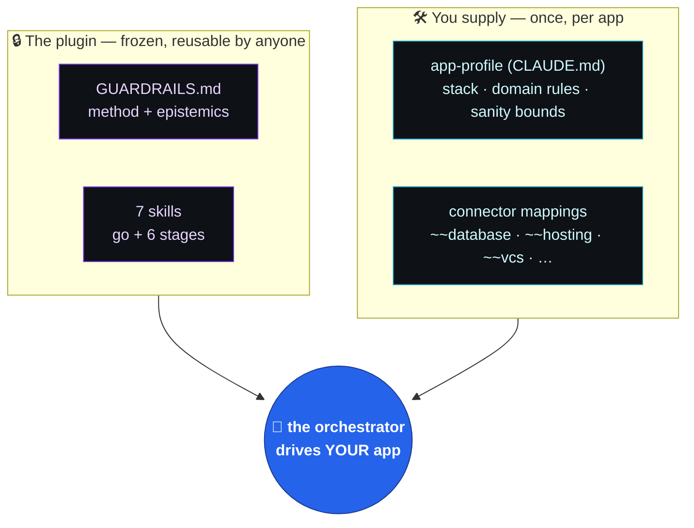

<div align="center">

# `orchestrator-loop`

### Turn Claude into a disciplined engineering lead.

*It plans the work · writes the spec · hands the coding to an executor · then independently QAs the result against reality — enforcing one fixed set of engineering guardrails and a skeptical, evidence-first way of working, the whole way.*

<br/>


**Claude Cowork** · **Claude Code** &nbsp;|&nbsp; one command to start a session: **`go`**

</div>

---

```text
        you bring a goal                          the orchestrator returns a verified result
              │                                                        ▲
              ▼                                                        │
   ╭───────────────────────────────────────────────────────────────────────────╮
   │   rules  →  roadmap  →  PRD  →  architect-review  →  handoff  →  verify ↺   │
   ╰───────────────────────────────────────────────────────────────────────────╯
     plan + QA stay with Claude            ·            an executor writes the code
```

> **The whole idea in one line:** you set **one goal**; the plugin drives the entire
> `rules → roadmap → PRD → handoff → verify` loop across as many PRDs as the goal needs —
> skeptically, forensically, honestly — and stops only when the goal is *met and independently
> verified*. High-leverage outcomes, low overhead, unusual velocity — **without** the usual cost
> of unverified autonomy.

---

## ⚡ The 60-second version

You don't micro-manage six skills. You type **`go`**, state a goal, and the orchestrator:



It **orients** (reads your project), **sets the goal** as a testable definition of done, then
**drives the loop to completion** — re-orienting at each seam, never stopping at a per-PRD
checkpoint, never asking *"want me to continue?"* It halts only on: goal verified, a genuine
decision that's yours, or you stopping it — and it **pauses automatically before anything
irreversible or real-money** (a production deploy, a DB migration, a trade).

---

## 🧩 Two layers: a frozen framework + your app

The framework is **app-agnostic**. It knows *how to work*, not *what your app is*. You supply the
specifics once, in an app-profile, and map abstract connectors to your real tools.



| | Frozen in the plugin | You bring |
|---|---|---|
| **What** | the guardrails + the loop + the epistemics | your app-profile + connector mappings |
| **Where** | `GUARDRAILS.md`, `skills/` | your repo's `CLAUDE.md` (from `app-profile.template.md`) |
| **Changes?** | no — it's the constant | yes — it's everything specific to your app |

---

## 🧠 The soul: how it *thinks* (not just what it does)

Most "autonomous coding" fails not by doing the wrong thing, but by **believing its own
output**. The guardrails encode a temperament against exactly that. Each rule ships with its
**why** and a one-line **war story** — because the reasoning is what lets an agent apply it to a
case the rule never anticipated.

| 🔎 Principle | What it forces |
|---|---|
| **A surprising-good result is a data bug until proven** | Distrust it, reproduce the exact number, find the contamination *before* you celebrate or report. |
| **Distrust the instrument, not just the result** | A monitor reading a leaked/in-sample source lies confidently — an impossible reading means the *instrument* is wrong. |
| **Root cause, not symptom** | Name the mechanism. Raising a timeout to "fix" a slow query is patching a symptom; read the plan. |
| **The same bug returns through a different door** | Fix every sibling path in the same change, or it silently comes back. |
| **Analytical rigor** | Out-of-fold-only for ship decisions · multiple-comparisons / FDR correction · no leakage · **no band-aids** (fix the model, never blend the failure away). |
| **Aggregate hides local** | A clean global average can mask one broken partition — gate **per partition**, not just corpus-wide. |
| **Forensic verification** | Reproduce the number yourself · read the *deployed* path · three signals (renders + network 200 + datastore) · check freshness. **Never trust the executor's "done."** |
| **Intellectual honesty** | Surface the unwelcome truth · no selling · terminate in a recommendation + next action, never a bare problem list. |
| **Build IN, not ON TOP** | Fix the existing path; one concept → one home; one write-path per store; structural change ships its own cleanup. |
| **Continuous execution** | Given autonomy, keep driving the roadmap to the goal — but pause hard before anything irreversible or real-money. |

---

## 🔁 The loop, stage by stage

Seven skills. You normally touch only the first — **`go`** orchestrates the other six. Each stage
skill keeps a lean `SKILL.md` and a deep `references/methodology.md` (progressive disclosure:
the spine up front, the full method + worked examples one click away).

| Skill | Role |
|---|---|
| 🟣 **`go`** | **The entry point.** Orient → set one goal → drive the whole loop to completion. Calls the six below internally. |
| 🧭 `roadmap` | Broad goal → a sequenced, numbered PRD roadmap. *Integrity & measurement before consumption.* |
| 📝 `draft-prd` | The house PRD format: proof in numbers, root cause, scope, **un-gameable, per-partition acceptance tests.** |
| 🏛️ `architect-review` | The 5 questions + constitution + CI guard that catch layering/forking **before** code is written. |
| 📦 `handoff-to-executor` | Package a reviewed PRD into a self-contained brief; one PRD in flight; explicit commit policy. |
| 🔬 `verify-handback` | Independent forensic QA — reproduce the number, read the deployed path, three signals, per-partition, freshness. |
| 🧰 `setup` | One-time guided onboarding: pick your executor, wire connectors, write the app-profile, confirm guardrails. |

---

## 🚀 Install

<details open>
<summary><b>Cowork (desktop app)</b></summary>

<br/>

**Settings → Plugins → Add plugin → GitHub →** enter `<owner>/orchestrator-loop`
*(or upload the `.plugin` file directly).*
Plugins activate on your **next session**, not mid-session.

> 💡 If the marketplace shows a stale version, the **`.plugin` file upload** is the reliable path
> (some installs cache the catalog server-side). Either way, the GitHub repo is the source of truth.

</details>

<details>
<summary><b>Claude Code (CLI)</b></summary>

<br/>

```bash
claude plugin marketplace add <owner>/orchestrator-loop
claude plugin install orchestrator-loop
```

</details>

### Then: one-time setup

Run the **`setup`** skill — say *"set up orchestrator-loop"*. It detects what's already wired,
picks your executor tier, maps your connectors, writes your `CLAUDE.md` app-profile, and confirms
the guardrails loaded. (Or do it by hand: copy `app-profile.template.md` → `CLAUDE.md` and fill it in.)

### Every session after that

> ### `go`
> State your goal — or just say **`go`** to pick up the roadmap. It orients, sets the goal, and
> runs the loop to completion.

---

## 🎚️ Executor tiers — friend-proof to power-user

The executor is referenced abstractly as `~~executor`; you choose what backs it. **Nothing is
hardcoded and nothing auto-installs** — `setup` verifies what's present and guides any gap.

| Tier | Executor | Setup | Best for |
|---|---|---|---|
| **1 — zero-setup** | the Cowork agent writes code directly | nothing to install | non-technical users, a quick start |
| **2 — power mode** | a coding CLI (e.g. Claude Code) via a shell MCP | connect the CLI + shell MCP | large, multi-PRD, autonomous runs |

> Even when one agent is *both* planner and coder (Tier 1), the **separation of concerns holds** —
> plan, build, and verify stay distinct phases, and you distrust your *own* "done" as hard as a
> stranger's.

---

## ✅ Test it before you trust it

Don't take the framing on faith — the plugin ships a **behavioral test kit** (`test/`): a
clean-room sample app-profile + scenarios drawn from real incidents (a too-good A/B result, a
dashboard reading a leaked source, a corpus average hiding a broken slice, a DROP-before-deploy, …)
and a pass/fail rubric.

> 🧪 **The one rule that makes the test valid: run it in a clean room** — a fresh session in a
> folder with *nothing* but this plugin and the sample app-profile. Run it inside a project whose
> memory already carries these rules and you can't tell whether the plugin or the ambient context
> produced the good behavior (*isolate the variable* — one of the plugin's own lessons). For a
> sharper signal, run each scenario once **with** the plugin and once **without**; it passes if the
> with-plugin answer hits the target behavior and the without-plugin answer is visibly more
> credulous. See `test/README.md`.

---

## 🗂️ What's in the box

```text
orchestrator-loop/
├── GUARDRAILS.md            # the method + epistemics (always-on)
├── CONNECTORS.md            # the ~~category → real-tool mapping guide
├── app-profile.template.md  # copy → your repo's CLAUDE.md
├── PUBLISHING.md            # how distribution / versioning works
├── skills/
│   ├── go/                  # 🟣 the session driver (entry point)
│   ├── roadmap/
│   ├── draft-prd/
│   ├── architect-review/
│   ├── handoff-to-executor/
│   ├── verify-handback/
│   └── setup/               # each: SKILL.md + references/
└── test/                    # clean-room behavioral test kit
```

---

## 📖 Two notes on delivery (read once)

> **Guardrails delivery.** The guardrails live in `GUARDRAILS.md`. In Claude Code they load
> automatically via a SessionStart hook. **Cowork doesn't reliably fire hooks**, so the guardrails
> are *also* carried by your app-profile — its **first line** must point to them: *"Operating under
> orchestrator-loop — the plugin's GUARDRAILS.md is always in effect; read it first."* The skills
> additionally enforce the relevant guardrails inline whenever they run.

> **No hardcoded executor / no bundled auto-install.** The framework never bakes a specific tool
> into the plugin; `setup` records your choice in the app-profile, verifies what's installed, and
> guides any gap — rather than assuming a bundled MCP auto-configures.

<div align="center">

---

**Plan with rigor. Build with leverage. Verify like an adversary. Ship the truth.**

`MIT` · app-agnostic · bring your own stack

</div>
