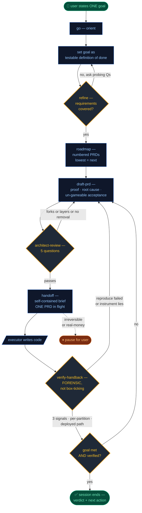
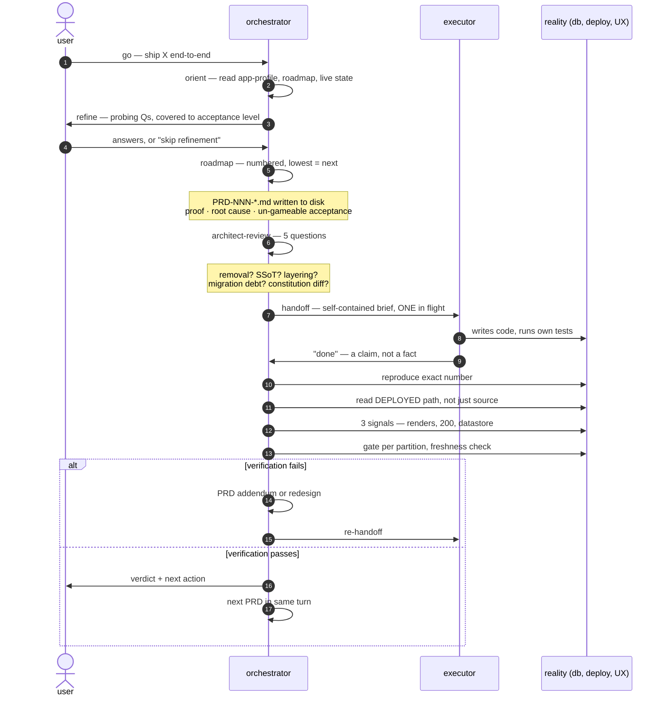

<div align="center">


<br/><br/>


&nbsp;
&nbsp;
&nbsp;
&nbsp;

</div>

> A coding agent that reports **"done"** on broken work is the single most expensive failure
> mode in autonomous engineering — because the failure is *invisible* until the next user hits
> it. `orchestrator-loop` is a Claude plugin (Cowork & Code) that forces the agent through
> **7 explicit gates** per change, separates the *planner*, the *builder*, and the *adversarial
> verifier* into distinct phases — even when one agent plays all three — and refuses to accept
> the executor's own "done." You set one goal; it drives the rest, and stops only when the
> result survives forensic verification.

<br/>

## The loop — at a glance



The orange diamonds are **gates that can reject and loop back**. The blue boxes are the
7 skills. The orange dashed line is the one mandatory pause: irreversible actions.

<br/>

## Why this exists — the failure mode it eliminates

The naive "agent writes code, I review" loop has **2 phases** and grades the agent's
output once, after the diff is written, by the same agent or a tired human. That loop
fails predictably:

1. The agent runs its own tests and reports green.
2. The metric is implausible — a too-good A/B lift, a Brier score below the chance floor,
   a "0 references" grep on a column that's still queried by the deployed bundle.
3. The agent doesn't reproduce the number; it cites it. Ship. Outage.

`orchestrator-loop` collapses that to a single rule
(see [`GUARDRAILS.md`](GUARDRAILS.md) → *Verification discipline*):

> *The executor's "done" is a **claim**. Re-establish every claim yourself, against reality —
> as an adversary trying to break the claim, not a co-author hoping it worked.*

Every one of the **50 bullet-pointed rules** in `GUARDRAILS.md` carries its own one-line
**`Seen:`** — a real production incident that the rule was paid for in. Eight of those
incidents are reproduced as scenarios in the clean-room test kit (`test/scenarios.md`).
This is not a manifesto; it is a debrief.

### A sample of what the loop rejects

> **Skepticism.** *"The executor reports +23 pts 7-day retention from a one-week A/B.
> Ship to 100%?"* — Loop refuses; reproduces the number; finds the assignment leak.
> Source: `test/scenarios.md` S1, maps to `GUARDRAILS.md` → *a surprising good result
> is a data bug until proven otherwise*.

> **Lying instrument.** *Dashboard shows Brier 0.02 — below the chance floor.*
> Loop flags the value as **structurally impossible**, concludes the monitor reads a
> leaked source, quarantines it. (S2.)

> **Aggregate hides local.** *Canary is −5 corpus-wide. Sign off?* No — re-runs
> per partition. The real incident: corpus-wide `−5` (healthy) hid a single day
> at `+57`. (S3, GUARDRAILS *aggregate hides local — gate per partition*.)

> **Same bug, different door.** *Forward pipeline fix held; backfill produced the
> same impossible rows.* The fix never propagated to the sibling path. (S5.)

> **Verified-deploy.** *Executor: "0 references in source, dropped, done."* Loop reads
> the **deployed bundle**, not just `git grep`. Real incident: a column dropped while the
> old frontend was still deployed turned every page-load into a 4xx. (S6.)

> **Continuous execution.** *Owner stepped away after PRD-1 of 5; loop kept driving
> across the seam.* The 11th scenario tests the most common autonomous failure:
> stopping behind "want me to continue?" with the roadmap unfinished. (S11,
> GUARDRAILS *Continuous execution — the autonomy contract*.)

<br/>

## By the numbers

What's encoded in this plugin, measurable from the repo:

| Surface | Count |
|---|---|
| Skills (each a discrete phase) | **7** |
| Operating-rule sections in `GUARDRAILS.md` | **14** |
| Bullet-pointed rules in `GUARDRAILS.md` | **50** |
| Real-incident war stories (`Seen:` lines) | **20** |
| Explicit `Why:` justifications | **22** |
| Lines of operating discipline (`GUARDRAILS.md`) | **449** |
| Total plugin content lines | **2,346** |
| SessionStart hooks (deliver guardrails) | **1** |
| Decision gates per PRD cycle | **7** |
| Required PRD sections (`draft-prd`) | **7** |
| Architect-review questions | **5** |
| Forensic verification steps (`verify-handback`) | **8** |
| Required signals per UI change | **3** |
| Connector categories (`~~category`) | **8** |
| Clean-room test scenarios | **11** (target 10/11 unprompted) |

The numbers are auditable: `wc -l GUARDRAILS.md` · `grep -c "Seen:" GUARDRAILS.md` ·
`ls skills/` · `grep -cE "^## S[0-9]+" test/scenarios.md`.

<br/>

## Anatomy of one PRD cycle



Artifacts produced per cycle, with typical sizes:

- **roadmap entry** — 1 row in the project's roadmap table.
- **PRD-NNN-*.md** — 7 required sections, on disk under the app's PRD folder.
- **architect-review block** — 5 question/answers, embedded in the PRD.
- **executor brief** — a short prompt referencing the PRD path + branch.
- **verification report** — verdict + the *orchestrator's* re-run numbers (never the
  executor's), with quoted evidence per failed acceptance.

Total decision gates the orchestrator can reject at: **7** —
refinement, roadmap dependency, draft-PRD proof, architect-review (×5 questions),
handoff scope, verify-handback verdict, session-completion boundary.

<br/>

## What the user does vs. what the loop does

| You do (once per session) | The loop does (autonomously) |
|---|---|
| Type `go` and state ONE goal | Orient against live state |
| Answer a short batch of refinement Qs | Decompose to numbered PRDs |
| Approve at irreversible boundaries | Draft → review → handoff → verify, PRD after PRD |
| | Re-orient between PRDs |
| | Stop **only** on the 3 valid boundaries |

The 3 valid stop conditions
(see [`GUARDRAILS.md`](GUARDRAILS.md) → *Continuous execution — the autonomy contract*):

1. Goal met **AND** independently verified.
2. Genuine blocker — real fork, missing credential, or irreversible action.
3. User stops it.

Anything else — finishing a PRD, hitting a passing test, "want me to continue?" — is an
explicit guardrail violation. The framework names this and forbids it.

<br/>

## What's frozen vs. what you bring

App-agnostic by design: the plugin knows *how to work*, not *what your app is*.

| 🔒 Frozen in the plugin | 🧩 You supply, once |
|---|---|
| The 5→7 loop + 50 rules + epistemics | `CLAUDE.md` app-profile |
| 7 skills + 8 reference methodologies | Connector mappings + sanity bounds |
| 1 SessionStart hook | Constitution + roadmap pointers |

The **app-profile** carries app-specific *facts* (stack, domain rules, sanity bounds for
what "too-good" means). The plugin carries the *method*. When the two seem to conflict,
the app-profile wins on facts; the plugin wins on method
(see [`GUARDRAILS.md`](GUARDRAILS.md) → top blockquote).

### The seven skills

| Skill | Role |
|---|---|
| **`go`** | entry point: orient · set goal · refine · drive |
| `roadmap` | broad goal → sequenced numbered PRDs |
| `draft-prd` | proof · root cause · un-gameable acceptance |
| `architect-review` | 5 questions before a single line of code |
| `handoff-to-executor` | self-contained brief; one in flight |
| `verify-handback` | reproduce · deployed path · 3 signals |
| `setup` | one-time onboarding · executor tier · connectors |

Each skill has a lean `SKILL.md` and a deep
`references/methodology.md` next to it.

<br/>

## Connectors

External tools referenced by **category**, mapped once in your app-profile:

| Category | Placeholder | Example |
|---|---|---|
| Executor | `~~executor` | Claude Code (Desktop Commander) |
| Version control | `~~vcs` | GitHub |
| Database | `~~database` | Supabase / Postgres |
| Hosting | `~~hosting` | Vercel / Fly |
| Browser QA | `~~browser-qa` | Claude-in-Chrome / Playwright |
| CI gate | `~~ci` | GitHub Actions |
| DNS | `~~dns` | Cloudflare |
| Project tracker | `~~project-tracker` | Linear / Jira |

Full list: [`CONNECTORS.md`](CONNECTORS.md). The framework never hardcodes a vendor.

<br/>

## Install

**Cowork.** Settings → Plugins → Add plugin → GitHub →
`alopanik/orchestrator-loop` (or upload the `.plugin` file). Activates next session.
Then run **`setup`** once; after that, every session is **`go`**.

**Claude Code.**

```bash
claude plugin marketplace add alopanik/orchestrator-loop
claude plugin install orchestrator-loop
```

> If a marketplace install shows a stale version, the **`.plugin` upload** is the reliable
> path (some catalogs cache server-side). The repo is always the source of truth.

### Executor tiers

| Tier | Executor | Best for |
|---|---|---|
| **1 — zero-setup** | Cowork agent writes code directly | quick start, non-technical users |
| **2 — power** | Coding CLI via shell MCP | long multi-PRD autonomous runs |

Even when one agent plays both roles, the phases stay separate in time — you distrust your
own "done" as hard as a stranger's
(see [`GUARDRAILS.md`](GUARDRAILS.md) → *When you are also the executor*).

<br/>

## Test it before you trust it

Ships a **clean-room behavioral test kit** in [`test/`](test/) — 11 scenarios, each
mapped to a guardrail and a real incident, with a pass/fail rubric. Run in a fresh
session with NOTHING but this plugin and `sample-app-profile.md` loaded — running it
inside a project whose memory already carries these rules conflates the variable
(*isolate the variable* — itself one of the plugin's rules).

**Target: 10/11 unprompted.** A reproducible miss in a clean room is a plugin gap;
file it against the cited guardrail. See [`test/README.md`](test/README.md).

<br/>

## Repository map

```
orchestrator-loop/
├── GUARDRAILS.md           # 449 lines · 14 sections · 50 rules · 20 war stories
├── CONNECTORS.md           # 8 categories · ~~category placeholders
├── PUBLISHING.md           # repo IS the marketplace
├── app-profile.template.md # the CLAUDE.md you fill in
├── .claude-plugin/         # plugin.json + marketplace.json
├── hooks/                  # 1 SessionStart hook → cats GUARDRAILS.md
├── skills/                 # 7 skills, 15 markdown files total
│   ├── go/                 # entry point + driving methodology
│   ├── setup/              # one-time onboarding + app-profile skeleton
│   ├── roadmap/            # broad → numbered PRDs
│   ├── draft-prd/          # 7-section PRD format
│   ├── architect-review/   # 5 questions
│   ├── handoff-to-executor/# self-contained brief
│   └── verify-handback/    # 8-step forensic ladder
├── assets/                 # hero / loop / verify SVGs
└── test/                   # 11-scenario clean-room kit
```

<br/>

<div align="center">

**plan with rigor · build with leverage · verify like an adversary · ship the truth**

<sub>MIT · app-agnostic · bring your own stack</sub>

</div>
